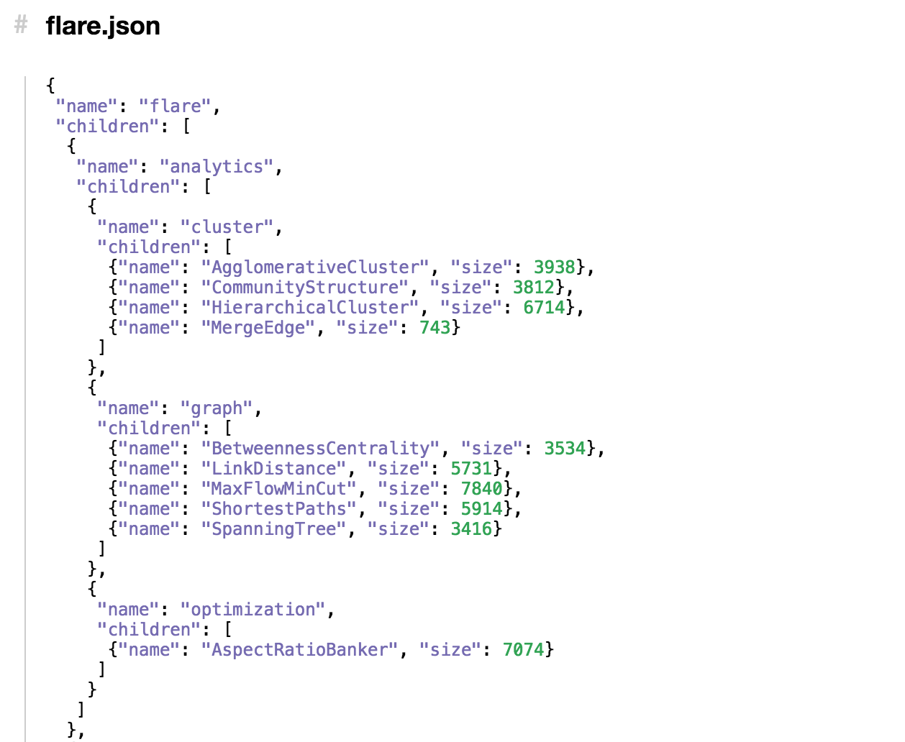
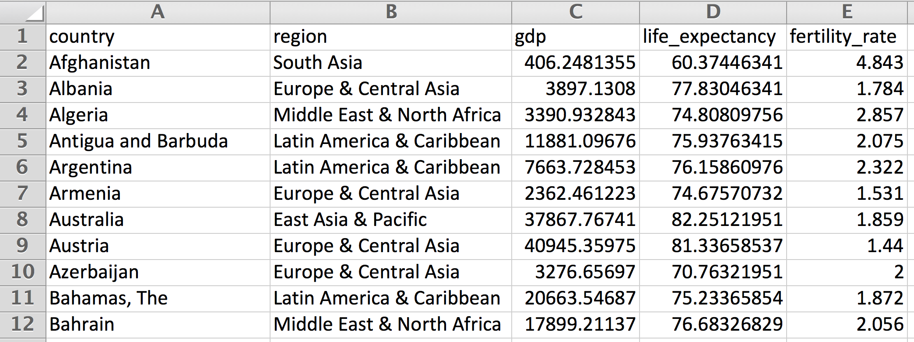
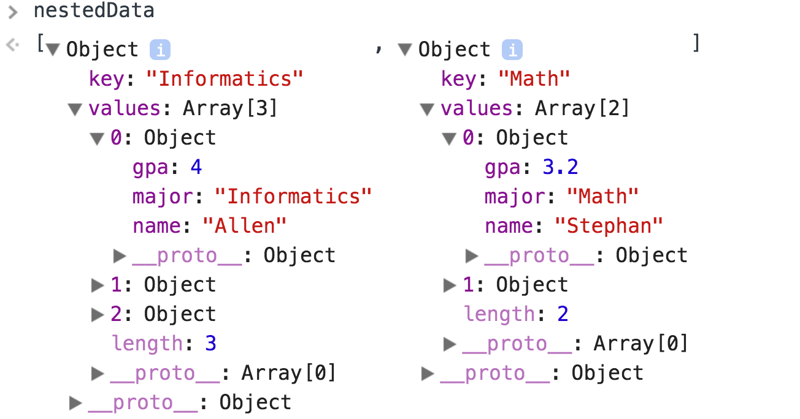
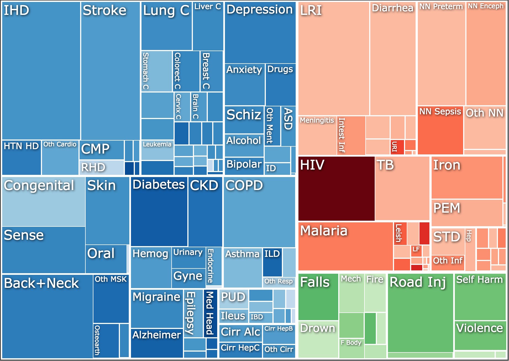
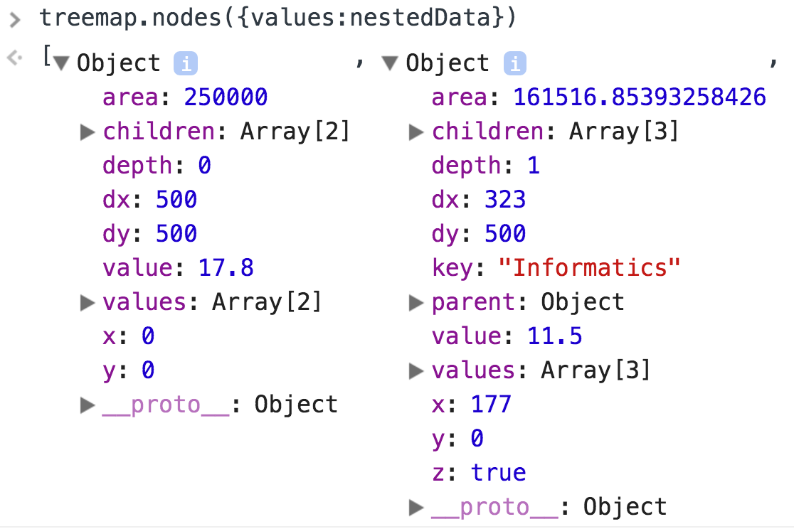

# Layout Functions

In this module, we'll introduce [D3 Layout Functions](https://github.com/mbostock/d3/wiki/Layouts) that facilitate manipulating your data structure to express hierarchical relationships. We'll use the example of a [Treemap](http://www.cs.umd.edu/hcil/treemap-history/) to examine the value of the layout functions.

Helpful links:

- [D3 Layouts](https://github.com/mbostock/d3/wiki/Layouts) _(d3 wiki)_
- [Nest Method](https://github.com/mbostock/d3/wiki/Arrays#nest) _(d3 wiki)_
- [Treemap Layout](https://github.com/mbostock/d3/wiki/Treemap-Layout) _(d3 wiki)_
- [Treemap Example](https://bl.ocks.org/mbostock/4063582) _(bl.ocks)_
- [Health Burden Example](http://vizhub.healthdata.org/gbd-compare/) _(Institute for Health Metrics and Evaluation)_

## Data Preparation
While hierarchical layouts in D3 _look_ quite impressive, it's important to remember that they follow the same process (the data-join) to achieve the same end (elements on the DOM) as any other chart type. The true challenge involved is computing the visual attributes (`width`, `height`, `x`, `y`, etc.) that drive the intended layout. Luckily, D3 provides a variety of tools that will help you calculate the visual attributes based on your dataset. Because these methods operate on a nested data structure, they require you to format your data in a particular way in order to use them.

### Data Structure
D3 layouts that express hierarchical data presume that your data is appropriately structured. For example, in the data used in [this example](https://bl.ocks.org/mbostock/4063582), the following structure is used:



The `.json` object is in a fairly standard structure. Note, each **object** has a **children array** which stores child nodes. At each **leaf node**, the children have a value that you want to visualize (in this case, `size`). While this data structure may be common in web oriented data storage platforms or `NoSQL` databases, it is quite distinct from how the data would be stored in a relational or tabular (i.e., `.csv`) format. Luckily, D3 provides us with methods for constructing a data tree from arrays of objects (the expected format for your relational data).

### Nesting Data
Let's assume that you data isn't stored in the necessary `.json` object, but instead is in a 2D table such as the following:



This data has a natural hierarchy in which each **country** has a parent **region**. The `d3.nest` method will allow us to construct a tree using the following syntax:

```javascript
// Array of objects, in the format returned by `d3.csv`
var data = [
  {name:'Allen', major:'Informatics', gpa:4.0},
  {name:'Beth', major:'Informatics', gpa:3.7},
  {name:'Ruben', major:'Informatics', gpa:3.8},
  {name:'Stephan', major:'Math', gpa:3.2},
  {name:'Alice', major:'Math', gpa:3.1},
];

// Construct a nesting function that will use each element's `major` property to group the data
var nest = d3.nest()// function that returns a function...
             .key(function(d){return d.major;});

// Pass your (tabular) data to the nest function to create your nested array
var nestedData = nest.entries(data);
```
The above section allows you to specify a **function** (`nest`) whose `entries` method will transform a tabular dataset into a nested data-object. The `key` value allows you to specify the value of each object that indicates the element's parent. The section above results in the following `nestedData` object:



## Treemaps
Treemaps allow you express data values for hierarchical data in a rectangular layout such as this [example](http://vizhub.healthdata.org/gbd-compare/) categorizing global disease burden into communicable diseases (red), non-communicable diseases (blue), and injuries (green).



Treemaps can be built either with `div` or `rect` elements, each of which has its own advantages. The example provided in [exercise-1](exercise-1) will use `div` elements, primarily because they enable simple text labeling, without having to worry about appending `text` elements (you can just set the `text` attribute of a `div`). As noted above, the challenge involved with building hierarchical layouts is computing the desired position of each element base on your data. To compute element positions, you'll  use the function exposed by the `d3.layout.treemap` method. Note, this method will take care of all of the scaling necessary, so you only need to specify your desired `width` and `height` for your layout:

```javascript
// Construct a treemap function that will retrieve values from your nested data
var treemap = d3.layout.treemap() // function that returns a function!
    .size([500, 500]) // set size: scaling will be done internally
    .sticky(true) // If data changes, keep elements in the same position
    .value(function(d) {return d.gpa;}) // Assert value to be used to compute element areas
    .children(function(d){return d.values;}); // Determine how the function will find the children of each node
```
This function is what you will use to **calculate** the desired positions of each visual element -- it **_will not_** build you a treemap. You'll need to perform a data-join and append elements to the screen as you would in any other context. There are a few important things to note in the above function:

> **Sticky**: This method is important if you plan on transitioning the position of each element (`div`, or `rect`) in your treemap. If you specify `true`, the layout algorithm will enforce a constraint that keeps elements in the same relative position if the data changes. If you don't specify `true`, the elements will rearrange into the optimal layout (will will likely change, and be quite confusing).

> **Value**: The `value` method is an accessor function that allows you to specify the attribute of each piece of data that you want to visually encode as the size (area) of the element.

> **Children**: The `children` method is another accessor function that allows you to specify the attribute of each piece of data that indicates how the `children` are stored. In the example above, the `nest` function will store the children in a property `values`, so that must be indicated to our `treemap` function.

In order to perform your data-join, you'll need to pass the `.data` function an **array of objects**, one for each visual element you want to create. The `.nodes` method of the `treemap` object we just created will return an array of objects for each element in the tree (including parent elements!). This method expects an **object** that it can traverse with specified keys for accessing the **children** of each object.

```javascript
// Retrieve the individual nodes from the tree
var treemapData = treemap.nodes({values:nestedData})
```

It's important to remember that this method will return an object for **all items in your tree**, including parent nodes. The method calculates attributes for positiong each element, and also tracks the `depth` of each item:



At this point, the necessary values have been calculated, and you can proceed with the data-join to create your visualization. To practice building a treemap, see [exercise-1](exercise-1).
